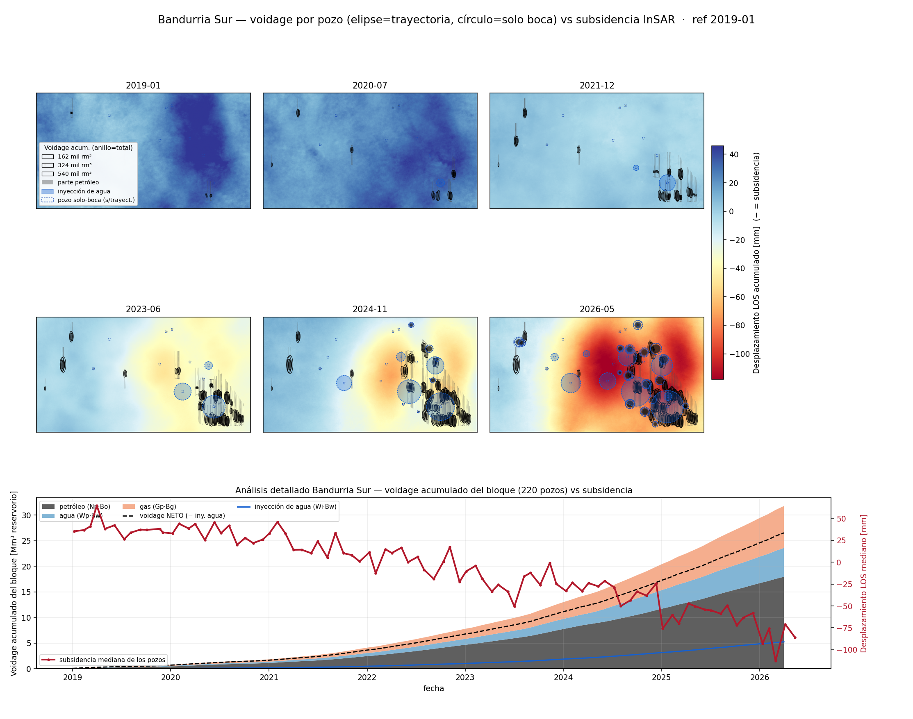
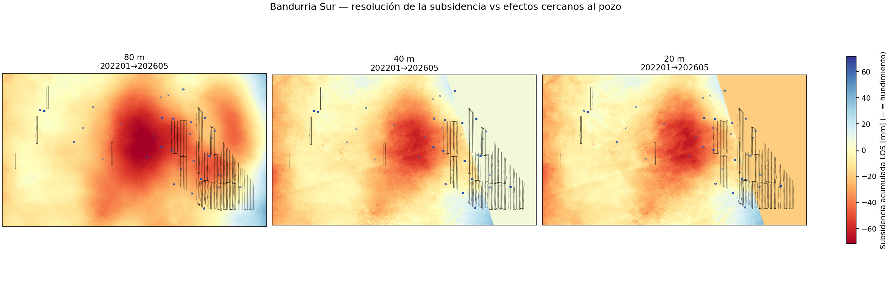
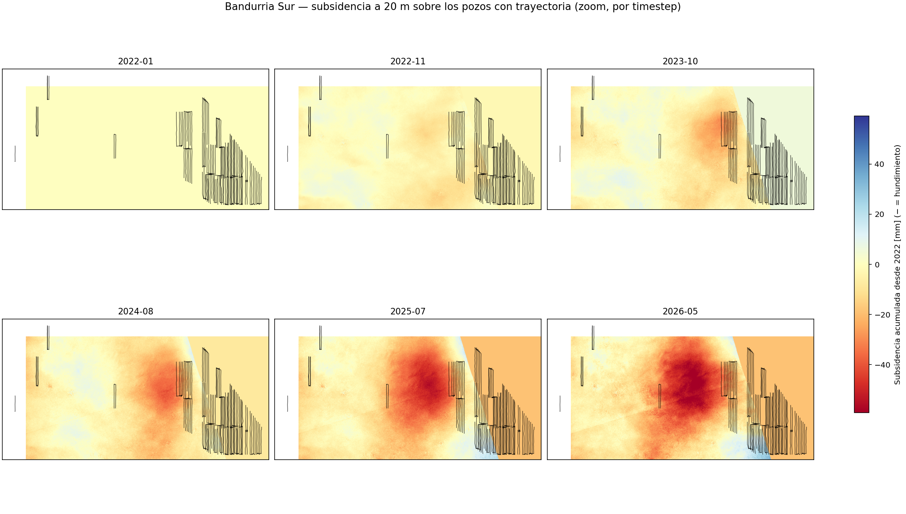

# Bandurria Sur en el tiempo

La página de [Análisis por pozo](pozos.md) cruza la deformación con la producción **acumulada** de
toda la ventana InSAR. Acá hacemos el zoom temporal sobre **un solo bloque** —**Bandurria Sur**, el de
subsidencia más fuerte de la escena (núcleo de *shale oil* de Añelo)— para **ver crecer** el cuenco a la
par de la producción, pozo por pozo. Todo con **datos públicos** (Capítulo IV de la Secretaría de
Energía + trayectorias de pozo de Vaca Muerta).

## Voidage por pozo vs subsidencia, cuadro a cuadro

Seis instantáneas entre 2019 y 2026. En cada panel:

- **Fondo:** desplazamiento LOS **acumulado** a esa fecha (azul = estable/uplift, rojo = subsidencia),
  con la misma escala de color en todos los paneles (referencia ene-2019).
- **Elipse** (orientada a lo largo del lateral): pozo **con trayectoria** (115 de los 220 del bloque),
  en el centroide de la rama. **Círculo punteado azul**: pozo **solo-boca** (105 pozos, casi todos de
  2024–2025, todavía sin geometría de rama cargada en el dataset público), en la boca.
- En ambos: **anillo** = voidage de reservorio **total** acumulado hasta esa fecha; **relleno** = la
  parte que es **petróleo** (Np·Bo). Misma escala volumétrica (rm³), así el anillo visible es el aporte
  de **agua + gas** de reservorio.
- **Azul** = **inyección de agua** acumulada (Wi·Bw), en la **misma escala volumétrica** que la
  producción → se ve que cada inyector mueve un volumen de reservorio **mayor** que el mayor productor.
- Cada pozo **aparece a partir de su completion** (fecha fin de terminación), con un marcador mínimo que
  luego crece con el volumen.

!!! note "Por qué importan los pozos solo-boca"
    El dataset público de **trayectorias corta en nov-2023**. Si se omiten esos 105 pozos, en **2025 se
    pierde el 55 %** de la producción de petróleo del bloque (65 % en 2026): se vería el cuenco de
    subsidencia profundizarse **sin pozos encima**. Por eso se incluyen en la boca (menor precisión
    posicional —el pad está en el *heel*, no sobre la rama— pero presencia correcta).

{ loading=lazy }

La película es contundente: en 2019–2020 casi no hay producción (elipses mínimas) y el terreno está
plano. A medida que entran pozos y el voidage crece, **el cuenco rojo se forma y se profundiza justo
donde se concentran las elipses más grandes** (racimo del sureste), llegando a **≈ −118 mm** acumulados.
La subsidencia es **focalizada en el racimo denso**, no bajo los pocos pozos aislados del noroeste.

## Deformación acumulada en el tiempo (slider)

La misma idea, **interactiva**: arrastrá el slider (o tocá ▶) y mirá crecer juntos el cuenco de
subsidencia (rojo) y el voidage de cada pozo. El **anillo** de cada elipse es el voidage de reservorio
total acumulado hasta esa fecha; el **relleno** es la parte que es petróleo. Las trayectorias son las
líneas oscuras; el contorno punteado es el bloque.

<iframe src="../assets/demo_bsur_slider.html" width="100%" height="600" style="border:1px solid #ccc;border-radius:6px"></iframe>

Hasta ~2021 las elipses son mínimas y el fondo está neutro; desde 2022 las elipses se inflan en el
racimo del sureste y el rojo aparece y se profundiza **bajo ese mismo racimo** — el acople
producción↔subsidencia, cuadro a cuadro.

## El acople en números (panel inferior)

El panel de abajo descompone el **voidage acumulado del bloque** (áreas apiladas, en Mm³ de reservorio)
y lo superpone con la **subsidencia mediana sobre los pozos** (línea roja, eje derecho):

| Componente (acum. 2026, 220 pozos) | Mm³ reservorio |
|---|---|
| Petróleo (Np·Bo) | **17.9** |
| Agua (Wp·Bw) | 5.6 |
| Gas (Gp·Bg) | 8.2 |
| **Voidage bruto** | **31.8** |
| Subsidencia mediana de los pozos | **−86 mm** |

El petróleo es la mayor componente del voidage, y la curva de subsidencia **se despega justo cuando
despega el voidage** (~2022) — el mismo acople producción↔compactación de la página por pozo, ahora
resuelto en el tiempo y sobre un bloque concreto. La línea **azul** es la inyección de agua del bloque
(9 inyectores, ~5.1 Mm³) y la **punteada** el voidage **neto** (producción − inyección): la inyección
recién pesa desde 2024 y no alcanza a frenar la subsidencia, dominada por la extracción.

!!! warning "Caveats"
    - **Pozos solo-boca:** 105 de los 220 se ubican en la **boca** (sin trayectoria pública); su elipse
      es un **círculo** sin orientación y posicionado en el pad, no sobre la rama drenada.
    - **Inyección incompleta:** se grafican los 9 inyectores que aparecen en el Cap IV de este set; la
      ubicación del inyector es su boca/pad.
    - **FVF aproximados** (Bo≈1.4, Bw≈1.03, Bg≈0.0035 rm³/sm³): valen para comparación relativa, no como
      balance volumétrico exacto.
    - **Correlación, no causalidad**; el voidage es colineal con la producción.
    - La elipse codifica **volumen** (tamaño) y **orientación** (azimut del lateral por PCA); no es el
      radio de drenaje físico.

*Datos: Capítulo IV (producción mensual por pozo, trayectorias) de la Secretaría de Energía; serie
temporal InSAR de este trabajo. Reproducible con `pipeline/fetch_bsur_monthly.py` (serie mensual por
pozo) y `pipeline/bsur_timesteps.py` (figura).*

## ¿Más resolución revela efectos más cercanos al pozo?

El mapa de subsidencia del sitio está a **80 m de píxel** (productos HyP3 `INT80`). ¿Conviene afinarlo
para ver detalle a escala de pozo? Hicimos un **reproceso piloto (2022–2026)** acotado a Bandurria Sur:
re-encargamos los interferogramas a HyP3 como **multi-burst** a **40 m** (`INT40`, looks 10×2) y **20 m**
(`INT20`, looks 5×1), y corrimos MintPy SBAS con el **mismo** punto de referencia, corrección
troposférica **ERA5** y *deramp* en los tres — para que la comparación sea **1:1 en magnitud**.

{ loading=lazy }

- **80 → 40 m:** salto real de detalle. El cuenco deja de ser una mancha lisa y se resuelve en
  estructura, con gradientes que se alinean con las filas de laterales.
- **40 → 20 m:** sólo un poco más de nitidez en bordes — **rendimiento decreciente**.

!!! note "Hay un techo físico"
    La subsidencia en superficie es una **imagen pasa-bajos** de la compactación profunda: el ancho de
    la cubeta de un pozo es **≈ la profundidad del reservorio** (~2.8 km acá). Por eso, más allá de
    ~40 m el píxel fino sobre todo agrega textura/ruido somero, **no** señal profunda nueva. Para señal
    a escala de **pad** haría falta **PS-InSAR** (dispersores puntuales sobre las locaciones) — en
    preparación.

### Zoom de alta resolución (20 m) sobre los pozos con trayectoria

A 20 m y recortando al núcleo de pozos con trayectoria, se ve el cuenco **formándose sobre las filas de
laterales** a lo largo del tiempo:

{ loading=lazy }

Hasta 2022 el terreno está plano; desde 2023 el hundimiento aparece y se profundiza **encima del
racimo de ramas**, justo donde el voidage de petróleo es mayor — el mismo acople, ahora a 20 m.

!!! warning "Caveats del reproceso fino"
    - **Piloto 2022–2026** (no toda la serie), multi-burst sobre 2 bursts IW2 que cubren el bloque.
    - El 80 m del panel comparativo se **re-procesó local** (mismo subset/ref/deramp/ERA5) para ser 1:1;
      difiere del mapa scene-wide del resto del sitio (deramp a escala de escena).
    - **PS-InSAR (MiaplPy)** en proceso; agregará el panel de deformación por pad.

*Reproducible: `pipeline/reproc/` (submit_burst.py → HyP3 multi-burst; compare_resolutions.py;
bsur_hires_timesteps.py). InSAR Sentinel-1, HyP3/ASF + MintPy + ERA5.*
