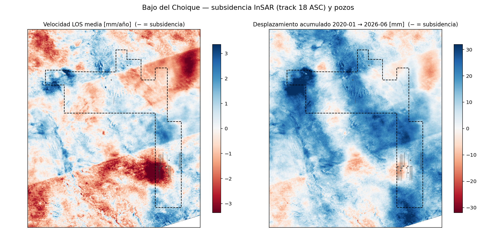
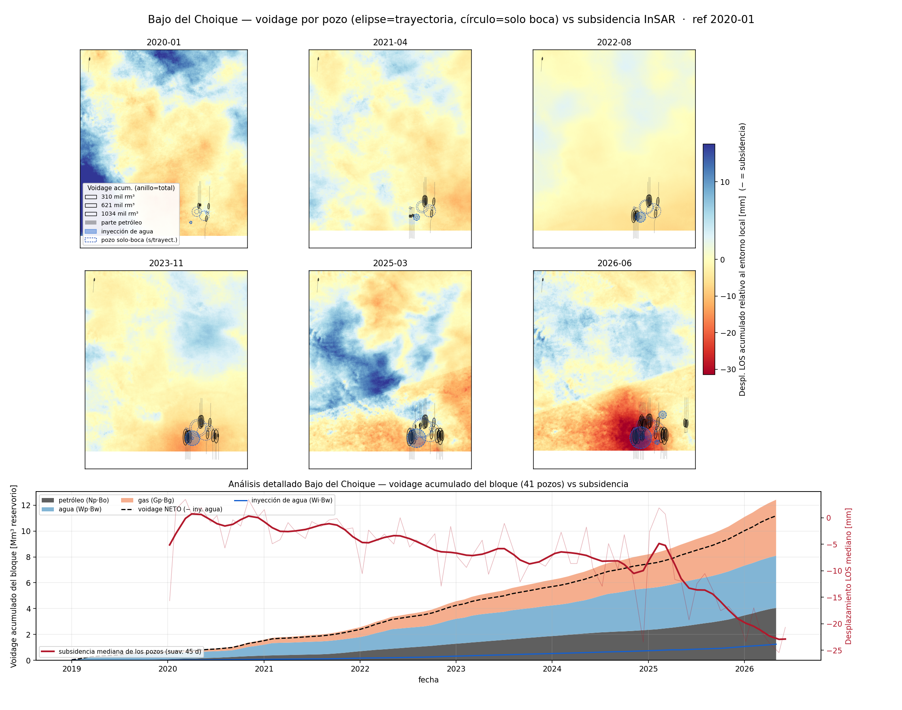

# Bajo del Choique

**Bajo del Choique – La Invernada** (Pluspetrol, ex ExxonMobil) es el bloque de *shale oil* más al
norte que analizamos — tan al norte que **cae fuera del footprint** del producto InSAR principal del
sitio: el frame 1050 del track 18 termina en lat ≈ −37.8° y el bloque está justo arriba. Para sumarlo
hubo que **procesar un stack propio**: 6 bursts del mismo track 18 ascendente (rectángulo IW2/IW3, el
primer job cross-subswath del proyecto), 228 pares SBAS mensuales 2020–2026 a 80 m, con el mismo flujo
HyP3 + MintPy + ERA5 del resto del sitio.

¿Por qué vale la pena? El bloque tiene **41 pozos** con historia en dos tandas bien separadas: el
piloto de ExxonMobil (2013–2019) y las campañas de Pluspetrol (7 pozos en 2021, 8 en 2025), con
**2.8 Mm³ de petróleo** y **3.9 Mm³ de agua** acumulados — y **1.2 Mm³ de agua inyectada** en 3
sumideros. Es decir: un experimento natural con un *antes* (2020) y un *después* (2021+ y 2025+).

## Velocidad y acumulado

El resultado: subsidencia **focalizada exactamente sobre el racimo de pads** del sureste del bloque,
con velocidades de hasta **−6 mm/año** y el entorno estepario esencialmente estable (mediana del
recorte: −0.1 mm/año). Es una señal más joven y más suave que la de Bandurria Sur o La Calera —
coherente con un bloque cuyo desarrollo masivo recién arranca.

{ loading=lazy }

## Voidage por pozo vs subsidencia, cuadro a cuadro

El mismo análisis por timesteps de [Bandurria Sur](bandurria-sur.md): fondo = desplazamiento acumulado,
elipse = voidage de reservorio por pozo (anillo total, relleno petróleo), azul = inyección de agua,
cada pozo aparece a partir de su completion. Con una diferencia técnica: acá la señal (~−20 mm) es
comparable a la atmósfera de una fecha suelta, así que cada cuadro se suaviza en el tiempo (σ=45 días)
y se **re-referencia a la mediana de la ventana** — lo que se ve es deformación **relativa al entorno
local**.

{ loading=lazy }

La secuencia es elocuente: hasta 2022 el terreno sobre los pads está neutro; el cuenco aparece con la
producción de la campaña 2021 y se **profundiza abruptamente en 2025–2026** (hasta ≈ −30 mm relativos),
cuando entran los 8 pozos nuevos y el voidage del bloque acelera. El panel inferior lo pone en números:
voidage bruto acumulado **≈ 12.4 Mm³ de reservorio** (petróleo 4.1 + agua 4.0 + gas 4.3) contra
**1.2 Mm³** inyectados, y la subsidencia mediana sobre los pozos baja de ~0 a **≈ −21 mm**, con el
quiebre de pendiente justo en la campaña 2025.

## Deformación acumulada en el tiempo (slider)

<iframe src="../assets/demo_choique_slider.html" width="100%" height="600" style="border:1px solid #ccc;border-radius:6px"></iframe>

!!! warning "Caveats"
    - **Stack propio a 80 m** (2020–2026): mismo track y flujo que el resto del sitio, pero **otro
      subset y otra referencia** — las magnitudes absolutas no son directamente comparables píxel a
      píxel con el mapa scene-wide.
    - **Producto multi-burst cross-subswath** (IW2+IW3): puede quedar una **costura** diagonal sutil
      entre subswaths, visible en la textura del ruido — no confundirla con estructura.
    - En los timesteps la deformación es **relativa al entorno local** (mediana de la ventana
      restada por cuadro) para separar la señal del modo común atmosférico/estacional (±10 mm).
    - **12 de los 41 pozos** no tienen trayectoria pública (van en la boca, círculo punteado).
    - **LOS, no vertical**; correlación ≠ causalidad; FVF aproximados (Bo≈1.4, Bw≈1.03, Bg≈0.0035).

*Datos: Sentinel-1 (ESA/ASF), HyP3 multi-burst INT80, MintPy SBAS + ERA5; Capítulo IV (producción,
trayectorias). Reproducible con `pipeline/choique/` (submit_burst.py → mapas_velocidad.py →
choique_timesteps.py → choique_slider.py).*
