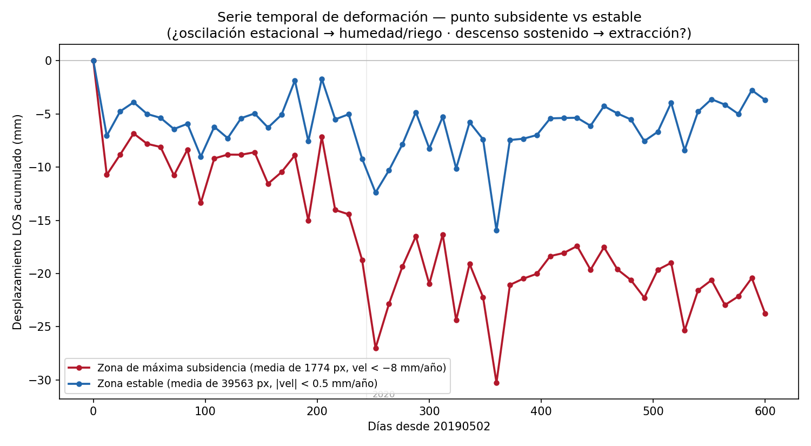

# Interpretación: ¿qué dicen los datos?

## Lo que se observa

1. **El fondo es estable** (~0 mm/año) — buena señal de que el método y la referencia funcionan.
2. **Subsidencia y uplift localizados** de varios mm/año, del orden de lo publicado para la cuenca
   (−8 a −10 mm/año [Brunori 2022]).
3. **Una franja que se hunde de forma sostenida**, asociada espacialmente a las zonas bajas / valle.

## El hallazgo del valle: subsidencia sostenida, no estacional

Promediando la serie temporal sobre la **zona de máxima subsidencia** (1.774 pixels, velocidad
< −8 mm/año) y comparándola con una **zona estable** (~40.000 pixels):

{ loading=lazy }

La zona subsidente **baja de forma sostenida ~24 mm en 20 meses (~15 mm/año)**, mientras la zona
estable se mantiene plana. La clave es que **no oscila y vuelve** (no es un ciclo estacional que se
revierte), sino que **acumula**.

### ¿Es por uso de agua?

Es una **hipótesis plausible**. La subsidencia a lo largo de valles fluviales regados es una **firma
típica de extracción de agua subterránea**: el bombeo baja el nivel piezométrico y los acuitardos
(arcillas) se compactan. Está documentada con Sentinel-1 en cuencas de todo el mundo: Fenhe (China,
hasta 81 mm/año [Fenhe 2025]), Ardabil (Irán [Ardabil 2022]), Aguascalientes (México [Aguascalientes 2021]).
El carácter **acumulativo** (no reversible) que vemos es **más consistente con un proceso persistente**
(extracción / compactación de sedimentos) que con un artefacto puramente estacional.

!!! warning "Lo que NO se puede afirmar todavía"
    - **Correlación, no causalidad.** InSAR no distingue por sí solo el mecanismo: extracción de agua
      subterránea, compactación natural de aluvión, o incluso un **artefacto de humedad de suelo**
      (en banda C, cambios de humedad en suelo desnudo/vegetación meten fase que parece desplazamiento).
    - Persiste algo de **ruido común-modo** (un bajón aparece en ambas zonas el mismo día ≈ residuo
      atmosférico no removido del todo).
    - La gran demanda de agua del fracking es mayormente de **agua superficial** del río, que por sí
      sola no explicaría una subsidencia del lecho — habría que mirar la **freática** del valle.

## Cómo confirmarlo: fuentes para cruzar

| Pregunta | Fuente |
|---|---|
| ¿Coincide con parcelas regadas? | **Sentinel-2 (NDVI)** — uso de suelo / agricultura |
| ¿Es estacional con el riego? | **ERA5-Land / SMAP** (humedad de suelo) + precipitación |
| ¿Baja la freática donde se hunde? | **AIC** (cuencas Limay-Neuquén-Negro), **DPRH Neuquén**, **DPA Río Negro** |
| ¿Niveles de acuíferos? | `energianeuquen.gob.ar` (datos de pozos) |
| ¿Aluvión vs roca? | **SEGEMAR** (geología) |
| Verdad de campo | **GNSS** continuo (no hay puntos cercanos → instalar = Fase 2) |

El cruce decisivo sería superponer la **serie temporal de subsidencia** con la **serie de nivel
freático** del valle: si bajan juntas, el caso por extracción de agua se vuelve fuerte.

## En resumen

El experimento **funciona**: con datos gratuitos se mide deformación milimétrica creíble en Vaca Muerta,
y los datos muestran una **subsidencia localizada y sostenida** que vale la pena investigar. El siguiente
paso es **cruzar con datos hidrológicos** para pasar de *correlación* a *atribución*.
