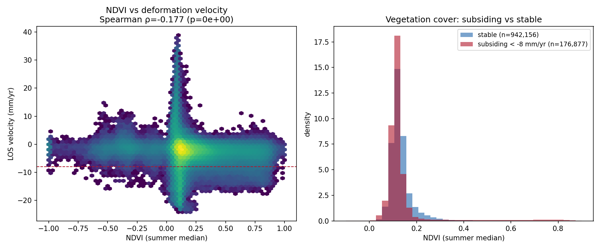

# Interpretación: ¿qué dicen los datos?

## Lo que se observa

1. **El fondo es mayormente estable** — buena señal de que el método y la referencia funcionan sobre
   un área grande (~210×210 km).
2. **Varias cubetas de subsidencia localizadas** de hasta ~12 mm/año, del orden de lo publicado para
   la cuenca (−8 a −10 mm/año [Brunori 2022]), más algún foco de uplift.
3. **Zonas que se hunden de forma sostenida durante 7 años**, no estacionales.

### Hay más de un mecanismo en juego

Las cubetas de subsidencia no responden todas a la misma causa. Mirando *dónde* caen, aparecen **al
menos dos firmas distintas**:

- **Sobre los bloques de shale más activos** → consistente con **compactación del reservorio por
  producción** (la presión de poro baja al extraer). Esta firma se desarrolla en
  [Producción vs subsidencia](produccion.md), donde la subsidencia media por concesión correlaciona con
  la producción de gas y el caso de Bandurria muestra el contraste inyección/extracción.
- **Sobre zonas bajas / valle fluvial** → la hipótesis de **agua subterránea** que se discute abajo.

Esta página se concentra en la segunda. Importa no mezclarlas: el agregado de "máxima subsidencia" que
sigue **promedia pixels de ambas firmas** a lo largo de toda el área, no solo el valle.

## El hallazgo: subsidencia sostenida durante 7 años, no estacional

Promediando la serie temporal sobre **todos los pixels de subsidencia fuerte** (~97.000 pixels con
velocidad < −8 mm/año, repartidos por toda el área —valle y bloques productivos—) y comparándola con una
**zona estable** (~530.000 pixels):

{ loading=lazy }

La zona subsidente **baja de forma sostenida hasta ~−82 mm en 7 años (~12 mm/año)**, mientras la zona
estable se mantiene plana. La clave es que **no oscila y vuelve** (no es un ciclo estacional que se
revierte), sino que **acumula** de manera clara y consistente a lo largo de toda la serie.

### ¿Es por uso de agua?

Es una **hipótesis plausible**. La subsidencia a lo largo de valles fluviales regados es una **firma
típica de extracción de agua subterránea**: el bombeo baja el nivel piezométrico y los acuitardos
(arcillas) se compactan. Está documentada con Sentinel-1 en cuencas de todo el mundo: Fenhe (China,
hasta 81 mm/año [Fenhe 2025]), Ardabil (Irán [Ardabil 2022]), Aguascalientes (México [Aguascalientes 2021]).
El carácter **acumulativo de 7 años** (no reversible) es **más consistente con un proceso persistente**
(extracción / compactación de sedimentos) que con un artefacto puramente estacional.

!!! warning "Lo que NO se puede afirmar todavía"
    - **Correlación, no causalidad.** InSAR no distingue por sí solo el mecanismo: extracción de agua
      subterránea, compactación natural de aluvión, o incluso un **artefacto de humedad de suelo**
      (en banda C, cambios de humedad en suelo desnudo/vegetación meten fase que parece desplazamiento).
    - Es **una sola línea de vista** (ascendente): no se separa el movimiento vertical del horizontal.
    - La gran demanda de agua del fracking es mayormente de **agua superficial** del río, que por sí
      sola no explicaría una subsidencia del lecho — habría que mirar la **freática** del valle.

### El test con NDVI: el riego no lo explica

Hicimos el primer cruce de esa lista: comparar las cubetas de subsidencia con un **mapa de NDVI de
Sentinel-2** (vegetación de verano, mediana de ~630 escenas sin nubes vía Microsoft Planetary Computer).
Si la subsidencia cayera sobre **parcelas regadas**, esos pixeles tendrían NDVI alto.

{ loading=lazy }

El resultado **no apoya la hipótesis de riego** a nivel agregado: sobre **8,8 millones** de pixeles, la
zona de subsidencia fuerte tiene NDVI mediano **0,11**, *menor* que la zona estable (**0,12**) — ambas
son estepa árida (las parcelas regadas estarían en NDVI > 0,4). Si acaso, lo subsidente está **menos**
vegetado: lo opuesto a lo que esperaríamos del riego. Esto **refuerza** que el driver dominante es
**producción / reservorio**, no agua de riego.

!!! note "Qué deja abierto"
    NDVI mide vegetación, no nivel freático. El test descarta el **riego superficial** como explicación
    del grueso de la subsidencia, pero **no** la dinámica de la **freática del valle**. Ese cruce sería
    decisivo, pero **no hay serie piezométrica pública** para el valle de Añelo: los repositorios abiertos
    (nacional **SNIH/BDHI**, **AIC**, Datos Abiertos Neuquén) solo tienen **agua de superficie**. Cerrarlo
    requiere **datos institucionales** (DPRH Neuquén / AIC, por pedido) o piezómetros de campo.

## Cómo confirmarlo: fuentes para cruzar

| Pregunta | Fuente |
|---|---|
| ¿Coincide con parcelas regadas? | **Sentinel-2 (NDVI)** — ✓ hecho: **no coincide** (ver arriba) |
| ¿Es estacional con el riego? | **ERA5-Land / SMAP** (humedad de suelo) + precipitación |
| ¿Baja la freática donde se hunde? | **DPRH Neuquén** / **AIC** / **DPA Río Negro** — ⚠ no son datos abiertos: requieren pedido institucional |
| ¿Niveles de acuíferos? | `energianeuquen.gob.ar` (datos de pozos) |
| ¿Aluvión vs roca? | **SEGEMAR** (geología) |
| Verdad de campo | **GNSS** continuo (no hay puntos cercanos → instalar = próximo paso) |

El cruce decisivo sería superponer la **serie temporal de subsidencia** con la **serie de nivel
freático** del valle: si bajan juntas, el caso por extracción de agua se vuelve fuerte.

## En resumen

El experimento **funciona**: con datos gratuitos se mide deformación milimétrica creíble sobre un área
grande de Vaca Muerta y 7 años, y los datos muestran **subsidencia localizada y sostenida** que vale la
pena investigar. El siguiente paso es **cruzar con datos hidrológicos** para pasar de *correlación* a
*atribución*.
