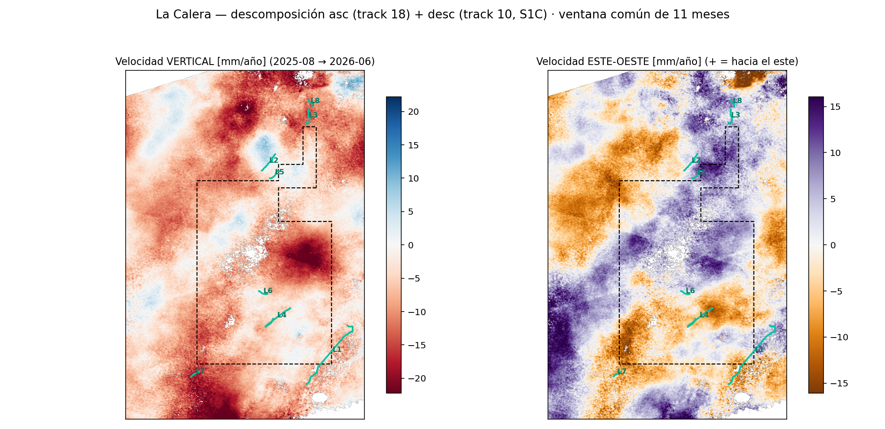
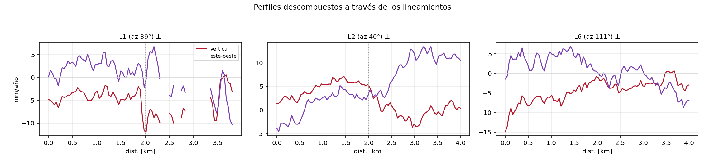

# La Calera — ¿flexuras o fallas?

Las páginas anteriores muestran **cuánto** se hunde el terreno sobre los bloques de Vaca Muerta. Esta
pregunta es distinta: **¿cómo** se hunde? ¿El cuenco de subsidencia es **suave** (la superficie se
flexiona como una membrana continua) o tiene **discontinuidades** — escalones donde un lado baja más
que el otro? Un escalón persistente es la firma de una **falla** que acomoda el movimiento diferencial;
una rodilla ancha y continua es una **flexura**. La distinción importa: fallas que llegan a superficie
son un dato geomecánico (integridad de pozos, sellos, sismicidad) que la cartografía pública de la zona
**no registra** — el SIGAM/SEGEMAR no mapea ninguna falla superficial dentro del bloque.

Elegimos **La Calera** (Pluspetrol/YPF, 152 pozos, núcleo de *shale gas* con condensado) porque es el
bloque con la señal más nítida después de Bandurria Sur: subsidencia de hasta **−9 mm/año** en el
producto de 80 m, con **dos lóbulos** que coinciden con los dos racimos de pads. Para buscar
discontinuidades hace falta más resolución: re-encargamos los interferogramas como **multi-burst a
40 m** (2020–2026, 228 pares SBAS, mismo flujo que el reproceso de Bandurria Sur) y corrimos MintPy con
ERA5 y referencia fija. El salto de resolución pagó: a 40 m el mínimo del cuenco llega a **−21 mm/año**
(el 80 m lo suavizaba a −9), verificado contra el producto scene-wide (correlación 0,89, diferencia
mediana 1,7 mm/año) y con el *deramp* validado (el centro del cuenco cambia <7 % sin él).

## El campo de velocidad y su gradiente

La herramienta central es el **gradiente espacial** de la velocidad, |∇v| en mm/año/km: donde el
hundimiento cambia bruscamente de un píxel al siguiente, el gradiente se enciende. Sobre el mapa de
|∇v| buscamos **lineamientos** (crestas elongadas de alto gradiente) de forma automática: umbral en el
percentil 96, componentes elongadas, esqueleto vectorizado y encadenamiento de segmentos colineales.

{ loading=lazy }

{ loading=lazy }

La **curvatura** (tercer panel) ayuda a clasificar: una **flexura** aparece como una banda de curvatura
de un solo signo (la "rodilla" del cuenco); una **falla** produce un **dipolo ±** apretado a ambos
lados de la cresta de gradiente. Los lineamientos crudos salen **fragmentados** del esqueleto, así que
el detector **encadena segmentos colineales**: une tramos de rumbo compatible (±25°) cuyo puente
también es colineal, con gaps de hasta ~3,5 km. La colinealidad es la clave — dos tramos paralelos
pero desplazados lateralmente (en échelon) **no** se unen.

El resultado son **ocho lineamientos**, dominados por una **familia NE (azimuts 36–61°)** que forma un
verdadero corredor estructural: **L1, de 8,5 km**, recorre el **flanco este del bloque** — justo donde
termina el campo de pozos —, con un cluster **en échelon** al norte (L2 de 2,3 km + L5 de 1,4 km,
paralelos, desplazados ~1 km) y pares menores (L6, L7). Un dato sugestivo: el corredor NE es
aproximadamente paralelo al borde oriental del desarrollo, lo que apunta a discontinuidades
**acopladas a la geometría del frente de compactación**; que además haya segmentos angostos en échelon
es el patrón que se espera si esa flexión está **reactivando planos preexistentes** de ese rumbo.

!!! note "El detector, validado antes de usarlo"
    Antes de creerle al método lo probamos contra sintéticos con **ruido real** de una zona quieta de
    la escena (σ = 0,57 mm/año): en ventanas de 4 km recupera la posición del escalón a ±1,5 píxeles y
    su amplitud con 9 % de error, y **rechaza el caso nulo** (sin escalón). En transectas largas el
    contraste suave-vs-escalón da falsos positivos (el fondo no es cuadrático a esa escala), así que
    los perfiles largos A-A'/B-B' son solo visuales y la clasificación corre únicamente en las
    perpendiculares locales de 4 km.

## Transectas: ¿escalón o pendiente?

Sobre cada lineamiento trazamos perfiles perpendiculares de 4 km — **tres** por lineamiento cuando
supera los 2 km (al 25/50/75 % del recorrido), para ver si el escalón **persiste a lo largo del
rumbo** — y ajustamos dos modelos en competencia: una superficie **suave** (cuadrática) y la misma
cuadrática **más un escalón** de ancho finito (función error). Si el escalón gana por margen claro
(ΔBIC > 10) y su salto supera 3 veces el ruido local, lo declaramos discontinuidad. El **ancho** del
escalón clasifica: ≲120 m (2–3 píxeles) es compatible con una **falla** aflorante o somera; 300–1000 m
es una **flexura**.

{ loading=lazy }

El veredicto, por estructura:

| Estructura | Largo | Azimut | Transectas | Veredicto |
|---|---|---|---|---|
| **L1** (flanco este) | **8,5 km** | 39° | +23,6 / −3,0 / +11,2 mm/año, w 500–1200 m | **flexura** que persiste a lo largo del rumbo, más marcada hacia los extremos |
| **L2** (cluster norte) | 2,3 km | 40° | −1,6 (**w=120 m**) / −3,5 / −3,3 mm/año | flexura con un tramo **clase falla** en su extremo NE |
| **L5** (en échelon con L2) | 1,4 km | 43° | −7,5 mm/año, w=500 m | flexura |
| **L6** (centro) | 1,0 km | 111° | −1,1 mm/año, **w=80 m** | **candidata a falla** |
| L3, L4, L7, L8 | 0,9–4,3 km | 1–150° | ΔBIC 27–308 | flexuras / indef. |

La lectura de conjunto: el hundimiento de La Calera **no termina en una rampa suave** — su flanco
oriental es una flexura continua de escala kilométrica, y dentro del corredor NE hay al menos **dos
tramos angostos (80–120 m) compatibles con fallas** que acomodan parte del movimiento diferencial.

## La prueba temporal: d(t) = B − A

Un escalón en el mapa de velocidad puede ser un artefacto (atmósfera, unwrapping). La prueba fuerte es
**temporal**: tomamos dos puntos A y B a ±200 m del cruce y graficamos la **diferencia de sus series**
d(t) = B(t) − A(t). Un escalón real **crece de forma monótona**, acoplado al desarrollo del bloque; un
artefacto es ruido sin tendencia. Las líneas azules marcan terminaciones de pozos a <2 km; la curva
gris, la producción acumulada del bloque.

{ loading=lazy }

Las series pasan la prueba, y cuentan historias distintas:

- **El corredor norte (L2a/b/c, L5):** caída **monótona de −7 a −11 mm** en 2020–2026, que se empina
  cuando la producción acelera (2024+) — incluido el tramo clase falla L2a. Movimiento diferencial
  sostenido y acoplado al bloque; no es atmósfera.
- **El flanco este (L1):** el diferencial de L1b está **plano hasta 2023 y recién ahí empieza a caer**
  (−6 mm a 2026) — la flexura oriental se "enciende" cuando el desarrollo se expande hacia el este.
  En L1c el contraste crece **+8 mm** de forma continua: el lado externo queda cada vez más arriba.
- **L6 (candidata a falla, centro):** −11 mm sostenidos, con dos terminaciones a <2 km (líneas azules)
  en el camino.

## Vertical y este-oeste: la descomposición con dos órbitas

Todo lo anterior mide en **línea de vista** (LOS) de una sola órbita ascendente — una mezcla de
movimiento vertical y horizontal este-oeste. Desde **agosto 2025**, el nuevo Sentinel-1C adquiere
también la órbita **descendente** (track 10) sobre La Calera, y con las dos geometrías se puede
**descomponer**: procesamos un stack descendente de 57 pares (mismos 40 m, misma referencia fija) y lo
combinamos con la ventana ascendente equivalente (2025-08 → 2026-06).

{ loading=lazy }

Dos resultados:

- **La tasa vertical actual es el doble de la media histórica**: el centro del cuenco baja a
  **≈ −38 mm/año** en esta ventana (la media 2020–2026 era −21) — la aceleración de la campaña
  2025 vista en la componente que importa.
- **El terreno converge horizontalmente hacia los cuencos**: al oeste del cuenco principal el suelo se
  mueve **hacia el este** (púrpura) y al este se mueve **hacia el oeste** (naranja), con ±10 mm/año.
  Esa contracción centrípeta es la firma clásica de la **compactación** a profundidad — el mismo
  patrón que Pepin & Zebker modelaron en el Delaware Basin
  ([referencias](referencias.md#deteccion-de-fallas-y-flexuras-en-superficie-con-insar)).

{ loading=lazy }

A través de los lineamientos, el movimiento diferencial **no es solo vertical**: en L1 hay un escalón
vertical angosto (≈ −12 mm/año justo en el cruce) y en L2 el salto reparte ~8 mm/año en vertical y
~8 mm/año en este-oeste — las discontinuidades acomodan cizalla y convergencia, no solo hundimiento.

!!! warning "Caveats de la descomposición"
    - **Ventana corta** (11 meses de descendente S1C): las tasas tienen más incertidumbre que las de
      la serie larga, y la componente este-oeste es intrínsecamente más ruidosa (±3–4 mm/año). El
      stack descendente crece cada 12 días, así que esta sección mejora sola.
    - El movimiento **norte-sur es invisible** para ambas órbitas (limitación geométrica de
      Sentinel-1); la descomposición asume que es despreciable.
    - Ventanas temporales distintas al resto de la página: acá todo es 2025-08 → 2026-06.

## Mapa interactivo

Todas las capas juntas: velocidad, gradiente, laterales, estructuras SEGEMAR regionales y los
lineamientos detectados. **Click en un lineamiento** (verde) abre su perfil transversal y su serie
diferencial d(t).

<iframe src="../assets/demo_calera_fallas.html" width="100%" height="620" style="border:1px solid #ccc;border-radius:6px"></iframe>

## Deformación acumulada en el tiempo (slider)

El mismo slider que en [Bandurria Sur](bandurria-sur.md): el cuenco crece a la par del voidage por
pozo. En La Calera domina el **gas** (13.000 Mm³ acumulados), así que las elipses de voidage de
reservorio son más chicas que en un bloque de petróleo — y aun así el cuenco es claro.

<iframe src="../assets/demo_calera_slider.html" width="100%" height="600" style="border:1px solid #ccc;border-radius:6px"></iframe>

## Qué dice la literatura

Buscar fallas como discontinuidades de subsidencia con InSAR tiene 25 años de historia: desde Las Vegas
([Amelung 1999](referencias.md#deteccion-de-fallas-y-flexuras-en-superficie-con-insar), fallas
cuaternarias como borde de cuencos por bombeo) hasta el análogo directo de este análisis: el **Permian
Basin** ([Staniewicz 2020](referencias.md#deteccion-de-fallas-y-flexuras-en-superficie-con-insar)) y en
particular el Delaware Basin, donde [Pepin 2022](referencias.md#deteccion-de-fallas-y-flexuras-en-superficie-con-insar)
modeló zonas lineales de subsidencia como **slip asísmico somero en fallas normales** bajo campos no
convencionales. La lista completa está en [Referencias](referencias.md).

!!! warning "Caveats"
    - **LOS, no vertical:** medimos en línea de vista (ascendente); un escalón LOS mezcla componente
      vertical y horizontal E-O. Con un solo track no se separan.
    - **40 m de píxel:** una falla real más angosta que ~2 píxeles aparece ensanchada; el ancho del
      escalón es un **límite superior**.
    - **Unwrapping:** los bordes de coherencia pueden generar escalones espurios — por eso la prueba
      temporal d(t) es obligatoria antes de llamar "falla" a nada.
    - **Correlación ≠ causalidad:** que un escalón crezca con la producción indica acople, no un
      mecanismo único (compactación diferencial, reactivación, o borde de compartimento).
    - La cartografía SEGEMAR 1:250.000 no mapea fallas dentro del bloque: los lineamientos InSAR son
      **hipótesis nuevas**, no confirmación de estructuras conocidas.

*Datos: Sentinel-1 (ESA/ASF), HyP3 multi-burst INT40, MintPy SBAS + ERA5; Capítulo IV (producción,
trayectorias); SIGAM/SEGEMAR (estructuras regionales). Reproducible con `pipeline/calera/`
(submit_burst.py → gradiente.py → transectas.py → pares_diferenciales.py → calera_fallas_map.py).*
