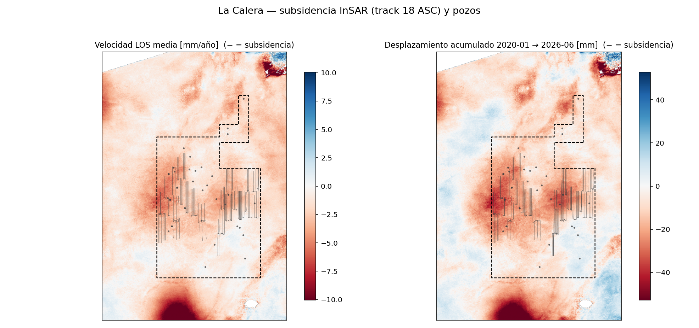
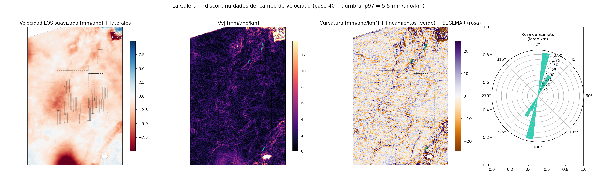
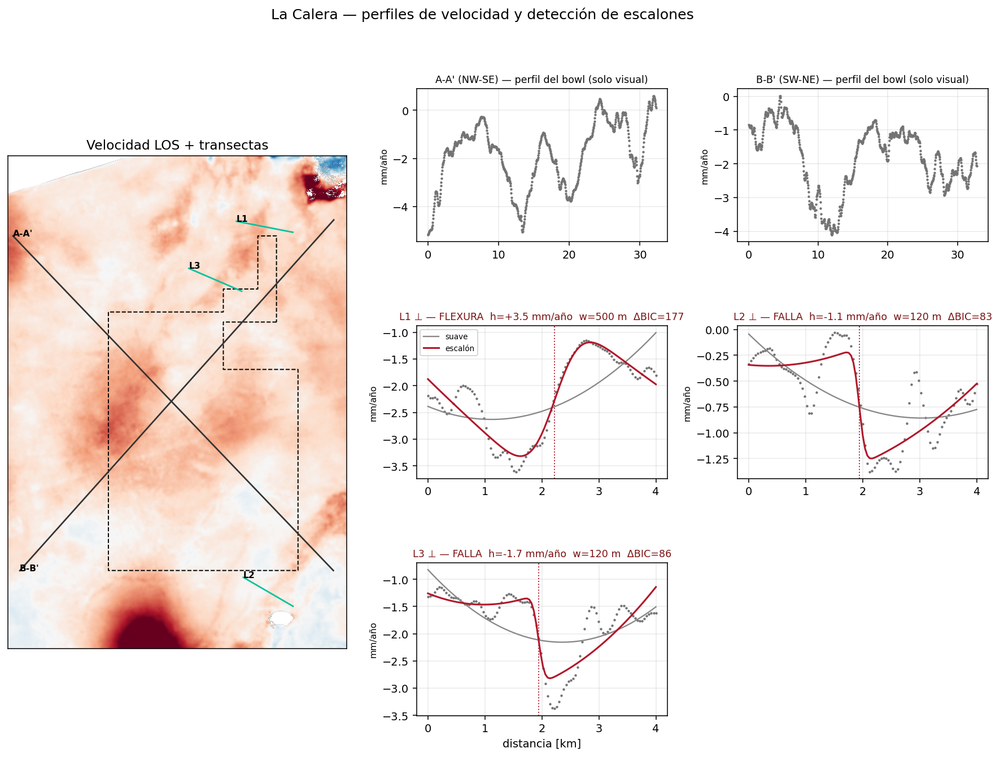
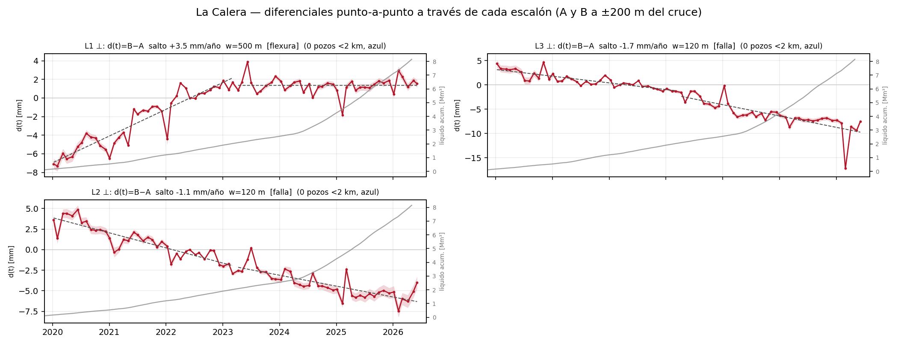

# La Calera — ¿flexuras o fallas?

Las páginas anteriores muestran **cuánto** se hunde el terreno sobre los bloques de Vaca Muerta. Esta
pregunta es distinta: **¿cómo** se hunde? ¿El cuenco de subsidencia es **suave** (la superficie se
flexiona como una membrana continua) o tiene **discontinuidades** — escalones donde un lado baja más
que el otro? Un escalón persistente es la firma de una **falla** que acomoda el movimiento diferencial;
una rodilla ancha y continua es una **flexura**. La distinción importa: fallas que llegan a superficie
son un dato geomecánico (integridad de pozos, sellos, sismicidad) que la cartografía pública de la zona
**no registra** — el SIGAM/SEGEMAR no mapea ninguna falla superficial dentro del bloque.

Elegimos **La Calera** (Pluspetrol/YPF, 152 pozos, núcleo de *shale gas* con condensado) porque es el
bloque con la señal más nítida después de Bandurria Sur: subsidencia de hasta **−9 mm/año** en el
producto de 80 m, con **dos lóbulos** que coinciden con los dos racimos de pads. Para buscar
discontinuidades hace falta más resolución: re-encargamos los interferogramas como **multi-burst a
40 m** (2020–2026, 228 pares SBAS, mismo flujo que el reproceso de Bandurria Sur) y corrimos MintPy con
ERA5 y referencia fija. El salto de resolución pagó: a 40 m el mínimo del cuenco llega a **−21 mm/año**
(el 80 m lo suavizaba a −9), verificado contra el producto scene-wide (correlación 0,89, diferencia
mediana 1,7 mm/año) y con el *deramp* validado (el centro del cuenco cambia <7 % sin él).

## El campo de velocidad y su gradiente

La herramienta central es el **gradiente espacial** de la velocidad, |∇v| en mm/año/km: donde el
hundimiento cambia bruscamente de un píxel al siguiente, el gradiente se enciende. Sobre el mapa de
|∇v| buscamos **lineamientos** (crestas elongadas de alto gradiente) de forma automática: umbral en el
percentil 97, componentes elongadas, y esqueleto vectorizado.

{ loading=lazy }

{ loading=lazy }

La **curvatura** (tercer panel) ayuda a clasificar: una **flexura** aparece como una banda de curvatura
de un solo signo (la "rodilla" del cuenco); una **falla** produce un **dipolo ±** apretado a ambos
lados de la cresta de gradiente. Tras filtrar bordes, segmentos cortos (<0,6 km) y candidatos lejos
del bloque, sobreviven **tres lineamientos** — y forman una **familia coherente NNE** (azimuts 11°,
23° y 30°): **L1** de 2,1 km en el borde norte del cuenco, **L2** (1,1 km) y **L3** (0,8 km). Un dato
sugestivo: ese rumbo es aproximadamente **paralelo a las filas de laterales** (los pozos navegan ~N-S,
perpendiculares a la fractura hidráulica ~E-O), lo que apunta a discontinuidades **acopladas a la
geometría del desarrollo** (borde del frente de compactación) más que a estructura regional heredada.

!!! note "El detector, validado antes de usarlo"
    Antes de creerle al método lo probamos contra sintéticos con **ruido real** de una zona quieta de
    la escena (σ = 0,57 mm/año): en ventanas de 4 km recupera la posición del escalón a ±1,5 píxeles y
    su amplitud con 9 % de error, y **rechaza el caso nulo** (sin escalón). En transectas largas el
    contraste suave-vs-escalón da falsos positivos (el fondo no es cuadrático a esa escala), así que
    los perfiles largos A-A'/B-B' son solo visuales y la clasificación corre únicamente en las
    perpendiculares locales de 4 km.

## Transectas: ¿escalón o pendiente?

Sobre cada lineamiento candidato trazamos un perfil perpendicular de 4 km y ajustamos dos modelos en
competencia: una superficie **suave** (cuadrática) y la misma cuadrática **más un escalón** de ancho
finito (función error). Si el escalón gana por margen claro (ΔBIC > 10) y su salto supera 3 veces el
ruido local, lo declaramos discontinuidad. El **ancho** del escalón clasifica: ≲120 m (2–3 píxeles) es
compatible con una **falla** aflorante o somera; 300–1000 m es una **flexura**.

{ loading=lazy }

El veredicto por lineamiento:

| Lineamiento | Largo | Azimut | Salto | Ancho | Clase |
|---|---|---|---|---|---|
| **L1** | 2,1 km | 11° | +3,5 mm/año | 500 m | **flexura** (la rodilla del cuenco) |
| **L2** | 1,1 km | 30° | −1,1 mm/año | 120 m | **candidata a falla** |
| **L3** | 0,8 km | 23° | −1,7 mm/año | 120 m | **candidata a falla** |

## La prueba temporal: d(t) = B − A

Un escalón en el mapa de velocidad puede ser un artefacto (atmósfera, unwrapping). La prueba fuerte es
**temporal**: tomamos dos puntos A y B a ±200 m del cruce y graficamos la **diferencia de sus series**
d(t) = B(t) − A(t). Un escalón real **crece de forma monótona**, acoplado al desarrollo del bloque; un
artefacto es ruido sin tendencia. Las líneas azules marcan terminaciones de pozos a <2 km; la curva
gris, la producción acumulada del bloque.

{ loading=lazy }

Los tres pasan la prueba, cada uno con su historia:

- **L1 (flexura):** el diferencial crece **+8 mm entre 2020 y 2023 y después se estabiliza** — la
  rodilla del cuenco se formó con la primera ola de desarrollo y llegó a un equilibrio.
- **L2 y L3 (candidatas a falla):** caída **monótona de −10 y −12 mm** en 2020–2026, que se empina
  cuando la producción acelera (2024+). Movimiento diferencial sostenido y acoplado al bloque — no es
  atmósfera.

## Mapa interactivo

Todas las capas juntas: velocidad, gradiente, laterales, estructuras SEGEMAR regionales y los
lineamientos detectados. **Click en un lineamiento** (verde) abre su perfil transversal y su serie
diferencial d(t).

<iframe src="../assets/demo_calera_fallas.html" width="100%" height="620" style="border:1px solid #ccc;border-radius:6px"></iframe>

## Deformación acumulada en el tiempo (slider)

El mismo slider que en [Bandurria Sur](bandurria-sur.md): el cuenco crece a la par del voidage por
pozo. En La Calera domina el **gas** (13.000 Mm³ acumulados), así que las elipses de voidage de
reservorio son más chicas que en un bloque de petróleo — y aun así el cuenco es claro.

<iframe src="../assets/demo_calera_slider.html" width="100%" height="600" style="border:1px solid #ccc;border-radius:6px"></iframe>

## Qué dice la literatura

Buscar fallas como discontinuidades de subsidencia con InSAR tiene 25 años de historia: desde Las Vegas
([Amelung 1999](referencias.md#deteccion-de-fallas-y-flexuras-en-superficie-con-insar), fallas
cuaternarias como borde de cuencos por bombeo) hasta el análogo directo de este análisis: el **Permian
Basin** ([Staniewicz 2020](referencias.md#deteccion-de-fallas-y-flexuras-en-superficie-con-insar)) y en
particular el Delaware Basin, donde [Pepin 2022](referencias.md#deteccion-de-fallas-y-flexuras-en-superficie-con-insar)
modeló zonas lineales de subsidencia como **slip asísmico somero en fallas normales** bajo campos no
convencionales. La lista completa está en [Referencias](referencias.md).

!!! warning "Caveats"
    - **LOS, no vertical:** medimos en línea de vista (ascendente); un escalón LOS mezcla componente
      vertical y horizontal E-O. Con un solo track no se separan.
    - **40 m de píxel:** una falla real más angosta que ~2 píxeles aparece ensanchada; el ancho del
      escalón es un **límite superior**.
    - **Unwrapping:** los bordes de coherencia pueden generar escalones espurios — por eso la prueba
      temporal d(t) es obligatoria antes de llamar "falla" a nada.
    - **Correlación ≠ causalidad:** que un escalón crezca con la producción indica acople, no un
      mecanismo único (compactación diferencial, reactivación, o borde de compartimento).
    - La cartografía SEGEMAR 1:250.000 no mapea fallas dentro del bloque: los lineamientos InSAR son
      **hipótesis nuevas**, no confirmación de estructuras conocidas.

*Datos: Sentinel-1 (ESA/ASF), HyP3 multi-burst INT40, MintPy SBAS + ERA5; Capítulo IV (producción,
trayectorias); SIGAM/SEGEMAR (estructuras regionales). Reproducible con `pipeline/calera/`
(submit_burst.py → gradiente.py → transectas.py → pares_diferenciales.py → calera_fallas_map.py).*
