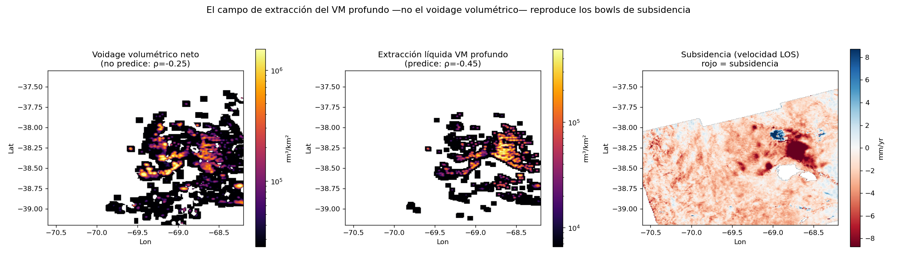
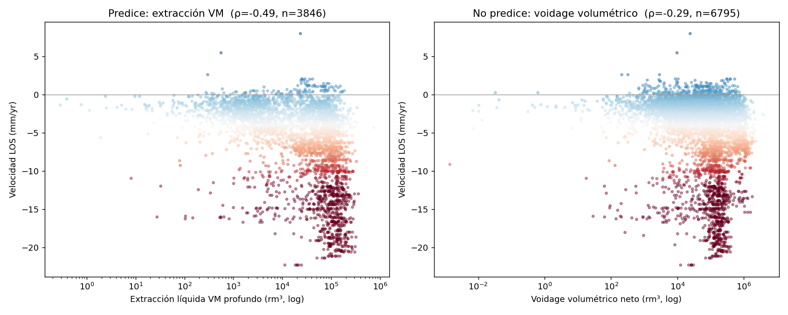

# Análisis por pozo

La página de [Producción vs subsidencia](produccion.md) cruza la deformación con la producción **por
concesión** (polígonos grandes). Acá bajamos a la **escala de pozo**: cada pozo de la cuenca con su
producción, inyección y diseño de fractura, ubicado sobre el mapa de velocidad. Todo con **datos
públicos** (Capítulo IV de la Secretaría de Energía + las trayectorias de pozo de Vaca Muerta).

## Mapa de pozos

Cada punto es un pozo (Vaca Muerta + inyectores), **coloreado por su velocidad LOS** (rojo =
subsidencia) y con **tamaño proporcional al volumen de reservorio drenado**. Los pozos fuertemente
subsidentes se concentran en el núcleo productivo de Añelo.

<iframe src="../assets/demo_pozos.html" width="100%" height="560" style="border:1px solid #ccc;border-radius:6px"></iframe>

## A escala de pozo, manda el petróleo (no el gas)

Cruzando la velocidad en cada pozo con su producción acumulada en la ventana InSAR (2019–2026), y
**separando por reservorio**, aparece un patrón claro:

| Grupo (profundidad mediana) | Mejor predictor | Spearman ρ |
|---|---|---|
| **Vaca Muerta / no-convencional** (~4800 m, *tight*) | **extracción de líquido** | **−0.49** |
| — petróleo | | −0.47 |
| — gas | | ≈ 0 (no significativo) |
| Convencional (~1800 m, otros horizontes) | desacoplado | ≈ 0 |

Es un **giro respecto a la escala de concesión**, donde el predictor era el gas (ρ=−0.32). La razón es
geológica: el *track* analizado cubre la **ventana de shale oil** de Añelo, y son los **horizontales
profundos a Vaca Muerta** —tight, de radio de drenaje chico— los que producen compactación localizada.
Lo convencional/somero está desacoplado de las cubetas.

## Voidage de reservorio: el volumen no alcanza, manda la presión

La hipótesis natural es que la subsidencia escale con el **voidage** (volumen de poro evacuado).
Convertimos los fluidos de superficie a volumen de reservorio con factores de volumen aproximados
(Bo≈1.4, Bw≈1.03, Bg≈0.0035 rm³/sm³) y armamos dos campos espaciales, comparables con la subsidencia:

{ loading=lazy }

<iframe src="../assets/demo_voidage.html" width="100%" height="560" style="border:1px solid #ccc;border-radius:6px"></iframe>

El **campo de extracción de líquido del Vaca Muerta** (centro) reproduce los bowls de subsidencia
(derecha) mucho mejor que el **voidage volumétrico neto** (izquierda): la correlación espacial pasa de
ρ≈−0.25 a **ρ≈−0.45**.

!!! note "Por qué el voidage volumétrico *no* alcanza"
    El **agua de fractura** inyectada (Adjunto IV) es del orden del **86 % del voidage de petróleo** en
    volumen de reservorio, y la mayoría **no vuelve como flowback**. Si se la suma al balance, el voidage
    volumétrico neto **casi se cancela**… y sin embargo los pozos siguen subsidiendo. La lectura física:
    en roca *tight* la subsidencia la gobierna la **depleción de presión de poro** (la extracción baja la
    presión → aumenta el esfuerzo efectivo → compacta), **no** el balance neto de volumen. Por eso la
    **extracción de líquido** —proxy de depleción— le gana a cualquier formulación de voidage.

## Inyectores vs productores

Separando los pozos en **inyectores** (de agua, a horizontes permeables) y **productores**, los
inyectores se asientan sobre terreno **significativamente más estable** (mediana −1.6 vs −2.6 mm/yr;
Mann-Whitney p≈10⁻³⁴): la inyección, donde ocurre, compensa la compactación.

{ loading=lazy }

!!! warning "Caveats"
    - **Voidage aproximado.** Los FVF son constantes de literatura (varían por ventana de fluido y
      presión); sirven para comparación **relativa/espacial**, no como balance volumétrico exacto.
    - **El voidage es colineal con la producción** — es una reinterpretación física, no una variable
      nueva e independiente.
    - **Correlación, no causalidad**; persisten confusores (geología, época, terminación).
    - El **uplift de Bandurria Norte** no se explica con datos públicos: no hay inyección reportada en el
      bloque (ni significativa dentro de ~15 km), y el realce ya crecía antes de la inyección vecina.
      Queda como señal **abierta** (posible respuesta geomecánica de borde), no atribuida a inyección.

*Datos: Capítulo IV (producción/inyección por pozo, trayectorias, coordenadas) y Adjunto IV (fractura)
de la Secretaría de Energía; velocidad InSAR de este trabajo. Reproducible con los scripts en el repo.*
