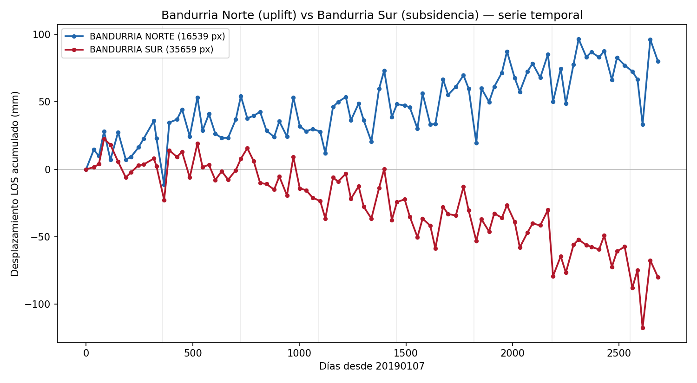

# Producción vs subsidencia

Hasta acá miramos *dónde* se deforma el suelo. Acá cruzamos ese mapa con dos capas más:
**la producción de hidrocarburos por área** y la **descomposición vertical** del movimiento.

Esta página desarrolla **una de las dos firmas de subsidencia** que aparecen en los datos: la asociada al
**reservorio / producción**. La otra —cubetas sobre el **valle fluvial**, candidatas a extracción de agua
subterránea— se discute en [Interpretación](interpretacion.md). Son mecanismos **complementarios**, no
excluyentes.

## ¿Se hunden más las áreas que más producen?

Para cada **concesión** (polígono oficial) se calculó la **subsidencia media** dentro del área
(estadística zonal sobre el mapa de velocidad) y se la cruzó con la **producción acumulada**
(gas, petróleo y agua, 2006–2026) de cada bloque.

{ loading=lazy }

El patrón salta a la vista: las áreas que más se hunden son **los bloques de shale más activos** de
Vaca Muerta — Bandurria Sur, La Amarga Chica y Loma Campana (YPF), seguidos de Aguada Federal y Bajada
del Palo (Vista), Fortín de Piedra (Tecpetrol) y La Calera (Pluspetrol).

### Mapa interactivo

Cada concesión coloreada por su subsidencia media. **Click** en un área para ver su producción
acumulada.

<iframe src="../assets/demo_produccion.html" width="100%" height="540" style="border:1px solid #ccc;border-radius:6px"></iframe>

### Correlación

Cruzando las 83 áreas con cobertura suficiente, la subsidencia media correlaciona de forma
**estadísticamente significativa con la producción de gas** (más producción → más subsidencia):

| Producción acumulada | Pearson r | Spearman ρ | p |
|---|---|---|---|
| **Gas** | −0.29 | **−0.32** | **0.004** |
| Petróleo | −0.18 | −0.07 | 0.54 |
| Agua | −0.16 | −0.06 | 0.60 |

Físicamente es esperable: la extracción baja la presión de poro del reservorio y el suelo se compacta.

!!! warning "Caveats (importante)"
    - **Correlación, no causalidad.** Hay confusores: los bloques de shale comparten geología, época de
      desarrollo y tipo de operación. La correlación es sugestiva, no una prueba.
    - **La velocidad es LOS** (línea de vista ascendente), no vertical pura — mezcla algo de movimiento
      horizontal. La [descomposición](#descomposicion-vertical) de abajo corrige esto en una zona.
    - **Períodos distintos:** producción acumulada 2006–2026 vs subsidencia 2019–2026.
    - Es **subsidencia del reservorio/área**, no necesariamente sobre cada pozo.

## Caso ilustrativo: Bandurria, inyección vs extracción

Dos concesiones pegadas muestran el contraste más claro de todo el experimento:

{ loading=lazy }

| | Producción (abr-2026) | Deformación (7 años) |
|---|---|---|
| **Bandurria Sur** (YPF) | 198 pozos activos, gas + petróleo + agua | **−80 mm** (subsidencia sostenida) |
| **Bandurria Norte** (Vista) | **0 pozos activos, 0 producción** (5 pozos no-conv. sin producir) | **+80 mm** (uplift sostenido) |

Las dos series son **imagen especular**: una baja y la otra sube, de forma monótona durante 7 años. Un
bloque que **no produce nada pero se levanta +80 mm** es la **firma típica de inyección de fluidos**
(descarte de agua de producción / mantenimiento de presión): la inyección sube la presión de poro y el
suelo se infla. Al lado, la extracción intensa de Bandurria Sur hace lo contrario.

!!! success "Confirmado: el uplift es vertical"
    Ampliando la [descomposición](#descomposicion-vertical) para cubrir Bandurria, el movimiento de
    Bandurria Norte resulta ser **uplift vertical real (+5.4 mm/año**, 2019–2020), no un artefacto
    horizontal — y Bandurria Sur, hundimiento vertical (−5.7 mm/año). Además ambos bloques se mueven
    **horizontalmente en sentidos opuestos** (Norte se expande, Sur se contrae): el patrón exacto de
    inflado vs deflación. La inyección pasa de hipótesis a lectura bien respaldada.

## Descomposición vertical { #descomposicion-vertical }

Combinando una órbita **ascendente** (track 18) con una **descendente** (track 112) sobre la región
Añelo–Bandurria, se puede **separar** el movimiento en sus componentes **vertical** (hundimiento/uplift
real) y **horizontal este-oeste** — algo que una sola línea de vista no permite.

Calculando el componente **vertical** por área, el resultado es nítido:

{ loading=lazy }

Todos los bloques productivos bajan verticalmente (Loma Campana −7.4, Bandurria Sur −5.7, La Amarga
Chica −5.6 mm/año…), y **Bandurria Norte —sin producción— es el único que sube (+5.4 mm/año)**. Esto
confirma que el uplift de Bandurria Norte es deformación vertical (inyección), no un efecto horizontal.

> La descomposición cubre el solapamiento de ambas órbitas (región Añelo–Bandurria) y el período común
> 2019–2020. Extenderla a toda el área (oeste/norte) requeriría una serie descendente más larga — un
> próximo paso.
