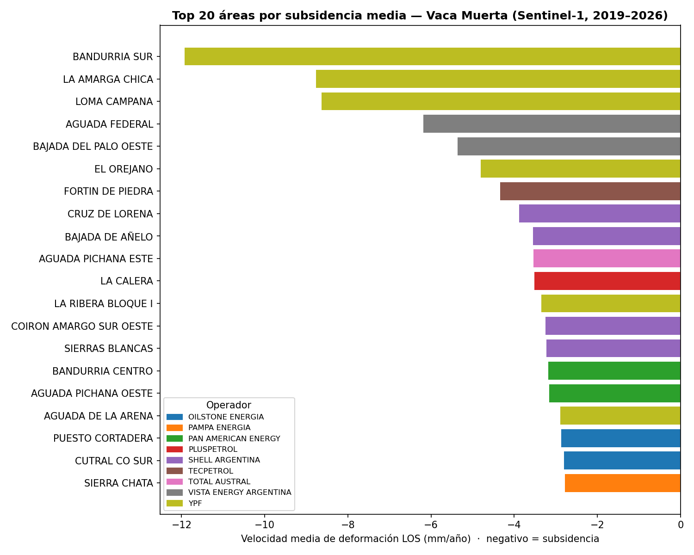
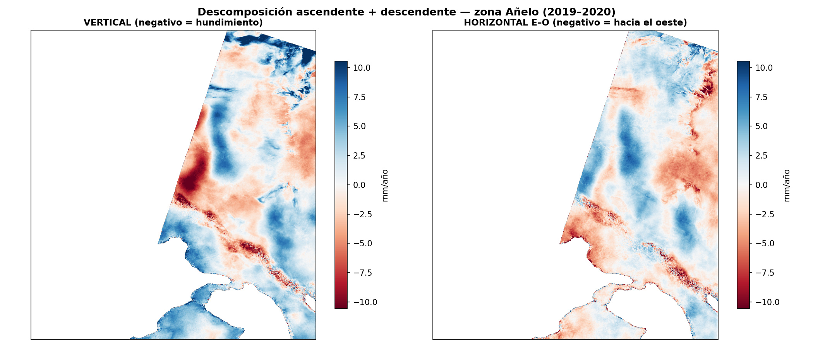

# Producción vs subsidencia

Hasta acá miramos *dónde* se deforma el suelo. Acá cruzamos ese mapa con dos capas más:
**la producción de hidrocarburos por área** y la **descomposición vertical** del movimiento.

## ¿Se hunden más las áreas que más producen?

Para cada **concesión** (polígono oficial) se calculó la **subsidencia media** dentro del área
(estadística zonal sobre el mapa de velocidad) y se la cruzó con la **producción acumulada**
(gas, petróleo y agua, 2006–2026) de cada bloque.

{ loading=lazy }

El patrón salta a la vista: las áreas que más se hunden son **los bloques de shale más activos** de
Vaca Muerta — Bandurria Sur, La Amarga Chica y Loma Campana (YPF), seguidos de Aguada Federal y Bajada
del Palo (Vista), Fortín de Piedra (Tecpetrol) y La Calera (Pluspetrol).

### Mapa interactivo

Cada concesión coloreada por su subsidencia media. **Click** en un área para ver su producción
acumulada.

<iframe src="../assets/demo_produccion.html" width="100%" height="540" style="border:1px solid #ccc;border-radius:6px"></iframe>

### Correlación

Cruzando las 83 áreas con cobertura suficiente, la subsidencia media correlaciona de forma
**estadísticamente significativa con la producción de gas** (más producción → más subsidencia):

| Producción acumulada | Pearson r | Spearman ρ | p |
|---|---|---|---|
| **Gas** | −0.29 | **−0.32** | **0.004** |
| Petróleo | −0.18 | −0.07 | 0.54 |
| Agua | −0.16 | −0.06 | 0.60 |

Físicamente es esperable: la extracción baja la presión de poro del reservorio y el suelo se compacta.

!!! warning "Caveats (importante)"
    - **Correlación, no causalidad.** Hay confusores: los bloques de shale comparten geología, época de
      desarrollo y tipo de operación. La correlación es sugestiva, no una prueba.
    - **La velocidad es LOS** (línea de vista ascendente), no vertical pura — mezcla algo de movimiento
      horizontal. La [descomposición](#descomposicion-vertical) de abajo corrige esto en una zona.
    - **Períodos distintos:** producción acumulada 2006–2026 vs subsidencia 2019–2026.
    - Es **subsidencia del reservorio/área**, no necesariamente sobre cada pozo.

## Descomposición vertical { #descomposicion-vertical }

Combinando una órbita **ascendente** (track 18) con una **descendente** (track 112) sobre la zona de
Añelo, se puede **separar** el movimiento en sus componentes **vertical** (hundimiento real) y
**horizontal este-oeste** — algo que una sola línea de vista no permite.

{ loading=lazy }

El panel **vertical** es la subsidencia "limpia" (sin contaminación horizontal): confirma las cubetas
de hundimiento localizadas, de hasta ~10 mm/año, sobre un fondo estable. El panel **horizontal** muestra
un patrón distinto, lo que justifica haber hecho la separación.

> Esta descomposición cubre solo el solapamiento de ambas órbitas (zona de Añelo, 2019–2020). Extenderla
> a toda el área requeriría una serie descendente más larga — un próximo paso.
