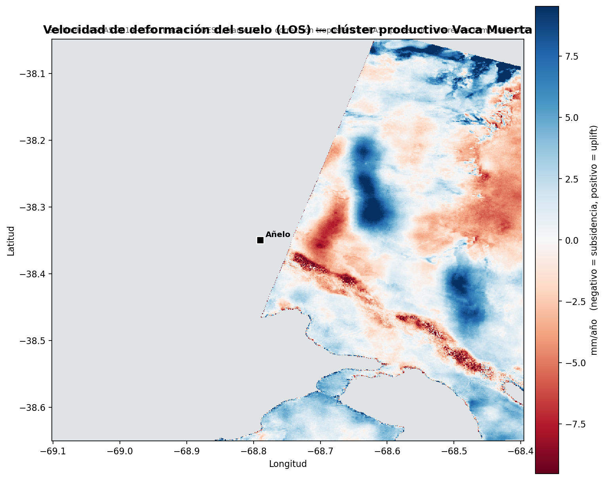

# Resultados

Tres formas de mirar el mismo dato: el **mapa de velocidad** (cuánto se mueve cada punto por año), la
**evolución temporal** (cómo se fue moviendo), y el **overlay sobre satélite** (dónde, geográficamente).

## Velocidad media de deformación (2019–2020)

<iframe src="../assets/demo_subsidencia.html" width="100%" height="520" style="border:1px solid #ccc;border-radius:6px"></iframe>

*Overlay interactivo sobre imagen satelital. Rojo = subsidencia, azul = uplift (mm/año). Zoom y
arrastre habilitados.*

| Métrica | Valor |
|---|---|
| Pixels confiables (coherencia > 0.7) | 255.609 (~40 % del área) |
| Velocidad mediana | **+0.5 mm/año** (fondo estable) |
| Percentil 1 / 5 | −7.3 / −4.8 mm/año |
| Percentil 95 / 99 | +7.0 / +10.4 mm/año |
| Coherencia temporal media de la red | 0.79–0.85 (muy alta) |

La **mediana cercana a cero** indica que la mayor parte del terreno es estable y que la referencia es
buena; las señales de subsidencia y uplift son **localizadas**, no un sesgo global.

## Deformación acumulada en el tiempo (slider)

<iframe src="../assets/demo_acumulado_slider.html" width="100%" height="560" style="border:1px solid #ccc;border-radius:6px"></iframe>

*Arrastrá el slider: cada paso es un trimestre y muestra cuánto se hundió (rojo) o levantó (azul) cada
punto respecto a la primera fecha. Con suavizado temporal para atenuar el ruido atmosférico de fechas
puntuales.*

## La lección metodológica: la atmósfera importa

El primer intento usó **solo 2019 (8 meses) sin corrección troposférica** y dio un resultado
**engañoso**: una subsidencia "generalizada" de −17 mm/año de mediana que en realidad era **artefacto**
(retardo atmosférico + ventana demasiado corta para separar la tendencia de lo estacional).

Al **extender a 2 años y corregir con ERA5**, el sesgo desaparece:

| | 2019 (sin tropo) | **2019–2020 + ERA5** |
|---|---|---|
| Mediana | −17 mm/año (artefacto) | **+0.5 mm/año** (estable) |
| % con < −8 mm/año | 87 % | **0.7 %** (localizado) |

Es un recordatorio de que en InSAR **el preprocesamiento define la conclusión**: sin corrección
atmosférica y con series cortas es fácil "ver" subsidencia donde no la hay.

## Mapa estático (respaldo)

{ loading=lazy }
